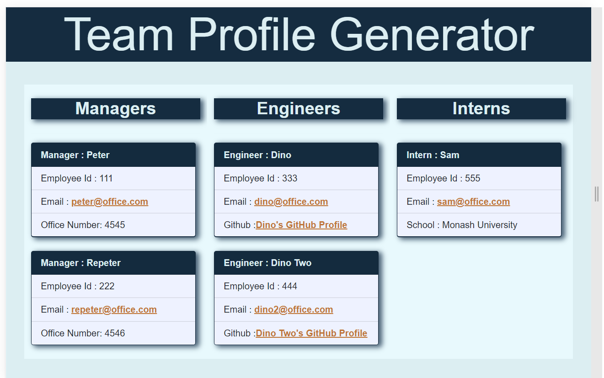

# Object-Oriented Programming: Team Profile Generator

# Functionality of this app 
## A Node command-line application that predomantiely uses the inquirer package and takes in information about employees and generates an HTML webpage that renders summaries for each person on HTML page.

# Installation

* Download or clone repository.
* Node.js is required to run the application
* npm install to install the required packages as per package.json 

# Usage

* App will prompt question by using node index.js command
* User will be prompted for the information to select employee typr
    * Manager
    * Engineer
    * Intern
* All employee will be asked the following information, all prompts are validated to ensure appropriate inpute to generate the correct output.
    * Name
    * Identification number
    * Email 
* Depending on employee role, additional prompts are presented
    * Manager - office number
    * Engineer - Github username
    * Intern - Schoo name

* This is a sample page website which generated using Team Profile Generatro application

## Example Video link
  [Video Demo](https://drive.google.com/file/d/1nJh5KNCzedye_ftcyRpfbpNlqcE0XO2q/view)
  

# Features and Techonlogies uses
* JavaScript
* Node.js
* Jest package
* Inquirer package
* Bootstrap

# License

## Under the MIT license 

